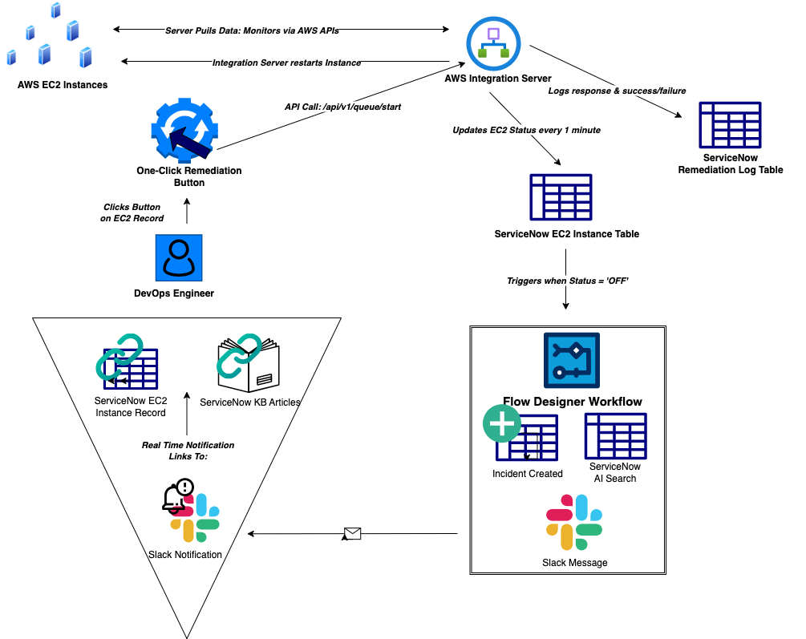

# EC2 Remediation System

**Netflix ServiceNow EC2 Incident Response System**

A semi-automated incident response system built on ServiceNow to help Netflix DevOps teams quickly remediate failing AWS EC2 instances that could impact streaming quality for millions of viewers.

## System Overview

This system addresses the critical business problem from last week's 45-minute EC2 failure in US-East region that caused viewer buffering and social media criticism. The solution provides automated incident detection, AI-powered knowledge retrieval, and one-click remediation for critical streaming infrastructure.

## Architecture

## Key Components

- **ServiceNow Scoped Application**: EC2 Monitoring and Remediation (x_snc_ec2_monitori)
- **Custom Tables**: EC2 Instance tracking and Remediation audit logs
- **Flow Designer Workflow**: Automated incident response orchestration
- **AI Search Integration**: Intelligent knowledge base article retrieval
- **One-Click Remediation**: UI Action for immediate EC2 instance restart
- **AWS Integration**: Secure connection to AWS Integration Server

## Workflow

1. **Failure Detection**: AWS Integration Server monitors EC2 instances and updates ServiceNow when status changes to "OFF"
2. **Automated Response**: Flow Designer workflow triggers simultaneously:
   - Creates incident record
   - Performs AI Search for relevant knowledge articles
   - Sends Slack notification with retrieved articles and direct record link
3. **DevOps Action**: Engineer receives notification, reviews knowledge articles, and clicks "Trigger EC2 Remediation" button
4. **Remediation**: System makes API call to AWS Integration Server to restart instance
5. **Audit Trail**: All remediation attempts logged with success/failure status and response details

## Implementation

### Core Infrastructure
- **Scoped Application**: EC2 Monitoring and Remediation
- **EC2 Instance Table**: Tracks instance status with fields for name, ID, and status
- **Remediation Log Table**: Audit trail for all remediation attempts
- **AWS Integration Server Connection**: Secure endpoint configuration
- **Basic Auth Credentials**: Authentication for API calls

### Automation Components
- **Flow Designer Workflow**: Orchestrates incident creation, AI search, and notifications
- **AI Search Integration**: Uses Knowledge Portal to retrieve relevant procedures
- **UI Action**: "Trigger EC2 Remediation" button with client-side JavaScript
- **Script Include**: EC2RemediationHelper for server-side API integration

### Knowledge Management
- **Knowledge Base Articles**: EC2 remediation procedures with optimized keywords
- **AI Search Discovery**: Automated retrieval during incident response

## Key Optimizations

### Enhanced Slack Notifications
Rich notifications including instance details, AI-retrieved knowledge articles, and direct ServiceNow record links for immediate remediation access.

### Intelligent Incident Management
Automated incident creation with proper categorization and assignment for streamlined DevOps workflow.

### Comprehensive Audit Trail
Complete logging of all remediation attempts with detailed response data for troubleshooting and analysis.

## Technical Specifications

### ServiceNow Components
- **Application Scope**: x_snc_ec2_monitori
- **Tables**: EC2 Instance, Remediation Log
- **Flow Designer**: Single workflow handling incident creation, AI Search, and notifications
- **UI Action**: "Trigger EC2 Remediation" with client-side JavaScript
- **Script Include**: EC2RemediationHelper for server-side API integration
- **Knowledge Base**: EC2 remediation procedures with optimized keywords

### Integration Details
- **AWS Integration Server**: codon-staging.emaginelc.com/api/v1/queue/start
- **Authentication**: Basic Auth with ServiceNow credentials
- **Data Refresh**: Automatic every 1 minute
- **Test Cycle**: Instances automatically change to "OFF" every 10 minutes

## DevOps Usage

### Receiving Alerts
When an EC2 instance fails, DevOps engineers receive Slack notifications containing:
- Instance identification and failure details
- Relevant knowledge articles retrieved by AI Search
- Direct link to the ServiceNow EC2 Instance record

### Remediation Process
1. Review knowledge articles provided in Slack notification
2. Click direct link to open specific EC2 Instance record in ServiceNow
3. Verify instance details and failure information
4. Click "Trigger EC2 Remediation" button on the record
5. Monitor Remediation Log for success confirmation

## Business Impact

This system significantly reduces incident response time by automating detection, providing immediate knowledge access, and enabling one-click remediation. The solution directly addresses the business-critical need to minimize EC2 failures that impact Netflix's streaming quality for millions of subscribers.

## Repository Contents

- `README.md` - This documentation
- `Diagram.png` - System architecture diagram
- `ec2-remediation-system.xml` - ServiceNow update set with complete implementation

## Installation

1. Import the update set `ec2-remediation-system.xml` into your ServiceNow instance
2. Verify AWS Integration Server connection configuration
3. Publish knowledge base articles
4. Configure Slack webhook URL for notifications
5. Test workflow by changing EC2 instance status to "OFF"

---

**Project completed as part of ServiceNow Workload #2 - Netflix EC2 Remediation System**
